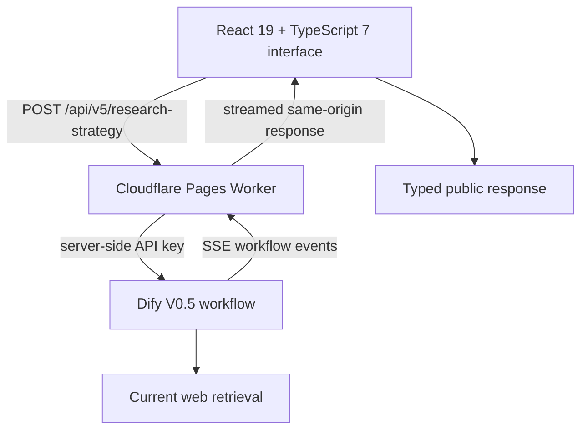

<div align="center">

# AI Growth Agent · V0.5

**Research first. Recommend second.**

Turn a fuzzy product brief into current findings, an auditable Evidence Board, and a citation-aware growth strategy.

[](https://github.com/ftw10181-oss/ai-growth-agent/actions/workflows/ci.yml)
[](https://ai-growth-agent.pages.dev/)
[](./backend/tests/)
[](./evals/)
[](./frontend/)
[](./LICENSE)

[**Open the live V0.5 workflow →**](https://ai-growth-agent.pages.dev/) · [Standalone demo](https://ai-growth-agent.pages.dev/demo) · [Product case](./docs/product-case.md)

</div>

---

## What V0.5 Does

AI Growth Agent is an evidence-backed research and strategy workflow for overseas growth teams. It does not jump from a short brief to a confident recommendation. V0.5 first decides what must be researched, retrieves current sources, applies deterministic evidence controls, and only then builds the strategy.

```text
Growth Brief → Research Plan → Live Search → Evidence Gate
             → Evidence Brief → Strategy Chain → Citation Map
```

The final interface makes four things visible:

- **What the workflow investigated** — three to five bounded, decision-focused research questions.
- **What the sources actually support** — supported, contested, or insufficient findings with limitations.
- **How evidence changes the strategy** — User Insight, Market Hypothesis, and Value Proposition retain upstream references.
- **What still needs human judgment** — explicit gaps, unknowns, risks, and validation priorities.

## What Changed in V0.5

| Before | V0.5 |
| --- | --- |
| Strategy generated from the supplied brief | Research runs before strategy generation |
| Brief-level evidence metadata | Current web sources with a normalized source manifest |
| Cross-module traceability | Claim-level citation resolution to retained findings |
| One deterministic strategy gate | Evidence Gate plus eight research-quality checks |
| Separate legacy demo interface | `/` and `/demo` now share one complete V0.5 product surface |

### 1. Bounded research planning

The agent creates three to five research questions tied to the decision in the brief. The plan limits scope before search begins and identifies which question is most critical.

### 2. Current source retrieval

Search runs as a bounded iteration. Results are normalized, deduplicated by canonical URL, linked back to query IDs, and capped at ten retained sources.

### 3. Deterministic Evidence Gate

Before strategy generation, code-level checks reject question mismatches, preserve contested evidence, cap unsupported confidence, audit freshness and source diversity, and expose all corrections.

### 4. Evidence Board

The UI shows research coverage, retained sources, supported findings, confidence, source links, limitations, audit corrections, and the largest remaining research gap.

### 5. Claim citation map

Material strategy claims resolve to retained findings. Claims that cannot resolve remain visibly classified as inference, contested, or unknown instead of inheriting false authority.

---

## Live Product Interface

The homepage and standalone demo now use the same V0.5 workflow and presentation layer.

1. Enter the product, market, audience, business goal, and any constraints.
2. Start **Research & build strategy**.
3. Keep the tab open while the event stream completes; a full research run can take around two minutes.
4. Review the Evidence Board before reading the recommendations.
5. Open the source links, research questions, quality checks, validation priorities, and citation references.

**Production:** [ai-growth-agent.pages.dev](https://ai-growth-agent.pages.dev/)
**Demo route:** [ai-growth-agent.pages.dev/demo](https://ai-growth-agent.pages.dev/demo)

No signup is required. Public usage is protected with per-visitor throttling, daily limits, and server-side credentials.

---

## Workflow Architecture


### Product boundary



- The browser never receives the Dify credential.
- The Worker opens the upstream event stream and proxies it without buffering.
- The frontend assembles the public `ResearchStrategyResponse` from the successful final event.
- Older API contracts remain available, while the public interface uses V0.5.

---

## Typed V0.5 Output Contract

The final workflow event contains nine typed objects:

| Output | Purpose |
| --- | --- |
| `context` | Facts, constraints, assumptions, and ambiguities from the brief |
| `research_plan` | Bounded questions, priorities, and decision relevance |
| `source_manifest` | Normalized sources, provenance, retrieval status, and failures |
| `evidence_brief` | Findings, confidence, coverage, limitations, and gaps |
| `evidence_audit` | Deterministic corrections applied by the Evidence Gate |
| `user_insight` | Jobs, pain points, adoption barriers, and validation questions |
| `market_hypothesis` | Opportunity, growth wedge, risks, and test priorities |
| `value_proposition` | Positioning, message pillars, and message experiments |
| `claim_citations` | Finding references for material downstream claims |

The interface validates the final event before rendering. Missing or malformed workflow outputs fail visibly instead of degrading into partial prose.

---

## Quality and Evaluation

Quality is treated as product behavior, not a prompt-writing preference.

- **56 backend regression tests** cover API boundaries, V0.2/V0.3 compatibility, V0.5 contracts, Dify parsing, source normalization, evidence controls, public quota protection, and strategy quality.
- **12 frozen evaluation cases** cover every supported business goal and boundary conditions.
- **Eight research-quality checks** verify planning, manifest integrity, citation resolution, evidence coverage, conflict preservation, source quality, claim language, and strategy continuity.
- **Three CI jobs** run backend pytest + ruff, frontend typecheck + ESLint + production build, and the offline LLM evaluation gate.
- **No live model call is required by CI**, keeping the contract gate deterministic and repeatable.

The published evaluation artifacts are in [`evals/results/baseline-v0.1`](./evals/results/baseline-v0.1/). They are an internal product-quality baseline, not a claim of customer or business impact.

---

## Repository Structure

```text
ai-growth-agent/
├── backend/
│   ├── app/                    # FastAPI routes, models, services, protection
│   └── tests/                  # 56 regression tests
├── frontend/
│   ├── src/App.tsx             # Unified V0.5 homepage and product interface
│   ├── src/demo/               # /demo entry reusing the V0.5 interface
│   ├── src/api.ts              # Streaming client and public response assembly
│   ├── worker/index.ts         # Cloudflare Pages Worker and SSE proxy
│   └── package.json
├── dify/
│   ├── workflow-v0.5.yml       # Importable V0.5 Dify workflow
│   ├── build_workflow_v05.py   # Reproducible workflow builder
│   └── code/                   # Source normalization and Evidence Gate code
├── evals/                      # Frozen cases and offline contract checks
├── docs/product-case.md        # Product case study
└── .github/workflows/ci.yml    # Three-job CI pipeline
```

---

## Local Development

### Frontend and exact Pages artifact

```bash
cd frontend
npm install
npm run dev
npm run typecheck
npm run build
npm run preview:pages
```

### Backend in deterministic mock mode

```bash
cd backend
python3 -m venv .venv
.venv/bin/pip install -r requirements-dev.txt
APP_MODE=mock .venv/bin/uvicorn app.main:app --host 127.0.0.1 --port 8000
```

### Evaluation contract

```bash
python3 evals/check_outputs.py evals/results/baseline-v0.1
```

### Dify workflow

Import [`dify/workflow-v0.5.yml`](./dify/workflow-v0.5.yml) into Dify, configure the model and search provider, publish the Workflow app, then store its `app-…` API key only in the server environment.

---

## Deployment

The production site uses Cloudflare Pages Advanced Mode:

- Project: `ai-growth-agent`
- Production branch: `main`
- Root directory: `frontend`
- Build command: `npm ci && npm run build`
- Output directory: `dist/client`
- Worker entry in the artifact: `dist/client/_worker.js`
- Required production secret: `DIFY_API_KEY`

```bash
cd frontend
npm run deploy:pages
```

The health endpoint reports the deployed product boundary:

```text
GET /health → { "status": "ok", "mode": "dify", "version": "0.5.0" }
```

---

## Product Principles

1. **Research scope must be bounded before retrieval.**
2. **Confidence cannot exceed the evidence that supports it.**
3. **Contested evidence must remain contested.**
4. **Material recommendations must preserve citation continuity.**
5. **Unknowns and human decisions must stay visible.**
6. **The public product contract must be testable without a live model.**

---

## Roadmap

- Calibrate confidence labels against human-rated research samples.
- Add scheduled live workflow evaluations alongside the deterministic CI gate.
- Persist strict cross-instance quota accounting with a Durable Object.
- Compare prompt and model variants behind the same typed V0.5 contract.
- Add exportable Evidence Board snapshots for portfolio and stakeholder review.

---

Built by Markus as an end-to-end AI product portfolio project: product strategy, workflow design, prompts, contracts, evidence controls, evaluation, frontend, and deployment.

## License

[MIT](./LICENSE)
