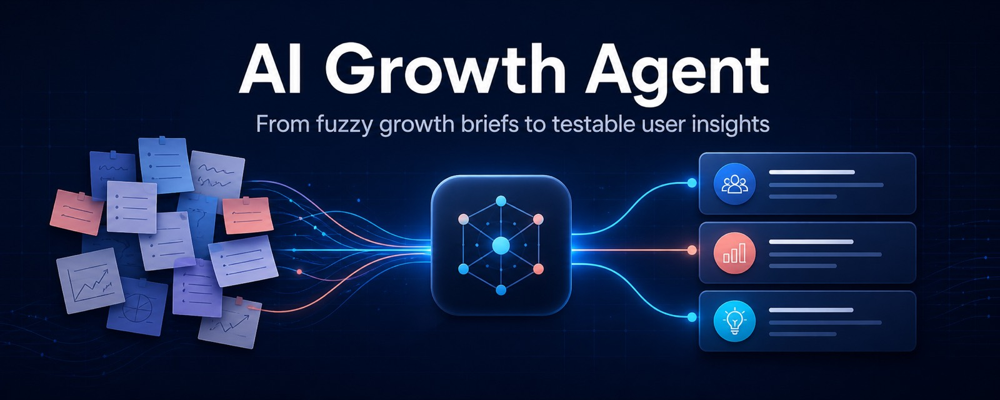
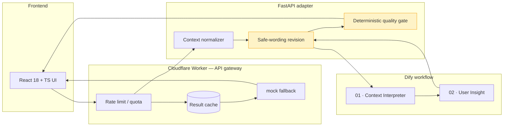

<p align="center">
  
</p>

<p align="center">
  <strong>An evidence-aware AI Agent that turns a fuzzy growth brief into testable user-insight hypotheses — built for AI product managers and growth engineers who care about <em>governed</em> LLM output, not just generated prose.</strong>
</p>

<p align="center">
  <a href="https://ai-growth-agent-portfolio.markus12138467907.chatgpt.site"><strong>🚀 Live Demo</strong></a>
  ·
  <a href="docs/architecture.md">Architecture</a>
  ·
  <a href="evals/README.md">Evaluation System</a>
  ·
  <a href="demo/sample-output/user-insight.json">Sample Output</a>
</p>

<p align="center">
  
  
  
  
  
  
</p>

---

## The story: why this project exists

Most AI products are demoed with one polished prompt and one hand-picked happy path. The moment you run them against a *real* growth brief — sparse context, conflicting goals, unfamiliar domains — they drift into confident, unverifiable market facts. That is not a product; it is a hallucination engine with a nice UI.

**AI Growth Agent is the counter-example.** It treats LLM output as a software engineering problem: the output must be *structured*, *evidence-aware*, *automatically checkable*, and *honest about what it does not know*.

The project grew out of a practical question a growth operator asked daily:

> "I have a fuzzy brief for a new market. What user insight can I actually act on — and how do I know which parts are safe to believe?"

The answer is a three-layer system — a **contract-governed AI Agent**, a **deterministic quality gate**, and a **repeatable LLM evaluation harness** — that turns that fuzzy brief into decision-ready hypotheses with explicit evidence, confidence, and validation status.

This is not a wrapper around an API. It is an argument about how AI growth tooling *should* be built: **governed, evaluated, and versioned like real software.**

---

## Demo

Try the full journey without an API key or Dify account:

<p align="center">
  <a href="https://ai-growth-agent-portfolio.markus12138467907.chatgpt.site"><strong>▶ Open the live demo</strong></a>
</p>

**What you'll see in under 3 minutes:**

1. Submit a six-field growth brief (product, market, audience, goal, context).
2. A **Context Interpreter** normalizes uneven input into a concise analysis brief and records explicit assumptions and ambiguities.
3. The **User Insight** stage generates hypotheses across JTBD (functional / emotional / social), pains, motivations, barriers, and scenarios — each tagged with an **evidence basis**, **confidence**, and **validation status**.
4. A **deterministic quality gate** independently checks structure, evidence consistency, research-question quality, and risky claim language — and reframes unsupported claims as `Hypothesis to test —`.
5. The UI renders insight cards, the auto-revision count, and any remaining review notes.

<details>
<summary><strong>Click to preview the frozen sample output</strong> (same shape as live, no credentials needed)</summary>

*Input brief:* "AI Translation Earbuds for frequent international business travelers in the US; goal = User Acquisition."

*Structured insight produced:*

```json
{
  "jobs_to_be_done": [
    {
      "job": "When a business conversation shifts languages, I want to understand and respond without interrupting the flow...",
      "dimension": "functional",
      "decision_relevance": "primary",
      "evidence": {
        "basis": "contextual_inference",
        "confidence": "medium",
        "validation_status": "needs_validation"
      }
    }
  ],
  "pain_points": [
    {
      "insight": "Fast group conversations may move on before a translated response is ready.",
      "decision_relevance": "primary",
      "evidence": {"basis": "contextual_inference", "confidence": "medium", "validation_status": "needs_validation"}
    }
  ],
  "research_questions": [
    "Think about the most recent time language friction changed a business conversation. What happened?",
    "What do you use today when a business conversation shifts languages, and where does it fall short?",
    "What evidence or result would you need before trusting a wearable translator in a meeting?"
  ],
  "quality_review": {
    "status": "passed",
    "auto_revision_count": 0,
    "checks": [
      {"code": "structure_contract", "status": "passed"},
      {"code": "evidence_contract", "status": "passed"},
      {"code": "research_question_patterns", "status": "passed"},
      {"code": "claim_language", "status": "passed"}
    ]
  }
}
```

Full frozen response: [`demo/sample-output/user-insight.json`](demo/sample-output/user-insight.json)
</details>

---

## Architecture



**Data flow, end to end:**

```text
Growth brief
   └─▶ Cloudflare Worker (rate-limit · quota · cache)
         └─▶ Context Interpreter → normalized brief + assumptions
               └─▶ User Insight → evidence-aware hypotheses
                     └─▶ Safe-wording revision (claim → "Hypothesis to test —")
                           └─▶ Deterministic quality gate (4 checks)
                                 └─▶ [fail → mock fallback]  ──▶ rendered UI
```

**Why it's built this way:**

| Layer | Technology | Why it exists |
|---|---|---|
| **Frontend** | React 18 + TypeScript + Vite | Lightweight, portable demo; deploys to edge |
| **API gateway** | Cloudflare Worker | Rate limits, per-visitor quota, result cache, graceful degradation at the edge — not in the model prompt |
| **Orchestration** | Dify workflow (YAML DSL) | Two versioned LLM nodes (`01-context-interpreter` → `02-user-insight`) with JSON-Schema-bound structured output |
| **Contract layer** | Pydantic v2 + JSON Schema | Cross-field invariants enforced at the boundary (e.g. `high confidence` requires `explicit_brief` evidence) |
| **Quality gate** | Deterministic Python/TS checks | *Independently* re-checks structure, evidence, research questions, and claim language — no model is the judge of itself |
| **Evaluation** | `evals/` harness | 12 fixed briefs, hard contract gates, 5-dimension rubric, frozen baseline |

> **Key design decision:** the quality gate runs *outside* the LLM. It is deterministic and transparent, so a recruiter or reviewer can trace exactly how risky wording got reframed and why a result `passed` vs. `review_required`.

### Repository map

```text
.
├── backend/                 FastAPI service + Dify adapter
│   └── app/
│       ├── models.py        Pydantic v2 domain models (V0.1/V0.2 contracts)
│       ├── quality.py       Deterministic post-generation quality gate
│       ├── protection.py    Rate-limit / quota helpers
│       └── services.py      Dify-call + mock-fallback logic
├── demo/sample-output/      Frozen, portfolio-ready example
├── evals/                   Fixed cases, rubric, checker, baseline report
├── dify/
│   ├── prompts/             Versioned node prompts
│   ├── schemas/             Structured-output contracts
│   └── workflow-v0.2.yml    Evidence-aware workflow (reproducible)
├── docs/                    PRD, architecture, product decisions
└── frontend/                React + TypeScript demo UI + Cloudflare Worker
```

---

## Run locally

Prerequisites: Python 3.11+ and Node.js 20+.

### 1. Backend (mock mode — no API key needed)

```bash
cd backend
python -m venv .venv
source .venv/bin/activate
pip install -r requirements.txt
cp .env.example .env
uvicorn app.main:app --reload
```

The default `APP_MODE=mock` is intentional: the full product journey runs without exposing an API key. API docs at `http://localhost:8000/docs`.

### 2. Frontend

```bash
cd frontend
npm install
cp .env.example .env
npm run dev
```

Open `http://localhost:5173` and submit the pre-filled example.

### 3. Connect Dify (optional, for live mode)

Import [dify/workflow-v0.2.yml](dify/workflow-v0.2.yml), select a model in your workspace, test, and publish. If the imported provider can't resolve, use [dify/workflow-v0.2.md](dify/workflow-v0.2.md) to build the same canvas manually. Then update `backend/.env`:

```dotenv
APP_MODE=dify
DIFY_BASE_URL=https://api.dify.ai/v1
DIFY_API_KEY=app-your-workflow-key
LIVE_DAILY_LIMIT=50
LIVE_PER_VISITOR_DAILY_LIMIT=2
LIVE_MIN_INTERVAL_SECONDS=60
LIVE_CACHE_TTL_SECONDS=86400
LIVE_FALLBACK_TO_MOCK=true
```

Keep the Dify key on the backend only. The browser never calls Dify directly. When the live quota is exhausted or Dify is unavailable, the demo returns a deterministic mock result instead of failing. The in-process counters are best-effort for a single backend or Worker isolate; use a shared counter + provider-side hard budget for strict multi-instance enforcement.

### 4. Development checks (CI-ready)

Every check below is what [GitHub Actions](.github/workflows/ci.yml) runs on every push/PR. Run them locally to match CI:

```bash
# Backend — tests + lint + format
cd backend
pip install -r requirements-dev.txt
pytest -v
ruff check .
ruff format --check .

# Frontend — type-check + lint + production build
cd ../frontend
npm ci
npm run typecheck
npm run lint
npm run build

# LLM Evaluation — offline contract gate (no API key required)
cd ..
pip install -r backend/requirements.txt
python evals/check_outputs.py evals/results/baseline-v0.1
```

> The evaluation gate reuses the backend Pydantic contracts, so a CI failure here means the committed baseline no longer satisfies the schema — exactly the drift this repo is designed to catch.

---

## API contract

`POST /api/analyze` — the unified route.

`POST /api/v2/insights` — versioned V0.2 contract; V0.2.1 is a compatible safety-layer update.
`POST /api/v1/insights` — compatibility alias.

```json
{
  "product": "AI Translation Earbuds",
  "product_description": "Real-time AI translation earbuds for cross-language communication.",
  "target_market": "United States",
  "target_audience": "Frequent international business travelers",
  "business_goal": "User Acquisition",
  "additional_context": "Entering the US market; test Reddit and TikTok."
}
```

Full response: [`demo/sample-output/user-insight.json`](demo/sample-output/user-insight.json).

---

## LLM Evaluation system

This repository does not trust one polished example. It ships a **repeatable evaluation harness**:

- **12 fixed briefs** covering six business goals and multiple product categories
- **Boundary cases** for sparse context, goal conflict, and unfamiliar domains
- **Hard contract gates** (structure, evidence, goal-consistency, JTBD dimensions, item counts)
- **Five-dimension human scoring rubric** (relevance, claim safety, actionability, clarity, completeness)
- **Offline checker** (`evals/check_outputs.py`) that reuses the backend Pydantic models — no drift between contract and checks

See [evals/README.md](evals/README.md).

### V0.1 live baseline (honest numbers)

The published Dify workflow completed **12/12 cases** with **100% schema, goal-consistency, JTBD-dimension, and item-count compliance**. Median end-to-end latency **21.5s** across **35,371 model tokens**.

Single-reviewer content score **3.75/5**. Relevance was strongest (**4.58/5**); **unsupported-claim safety was the main weakness (2.67/5)** — inferred behaviors were sometimes phrased as facts, so only 2/12 cases met the full publish threshold.

**V0.2 exists *because* of that finding**: it adds a mandatory evidence contract to every insight item and a deterministic safe-wording revision. This is what a healthy evaluation loop looks like — measure honestly, then make the next version fix the measured weakness.

These are internal synthetic-case results, not user research or evidence of business impact. See the [baseline report](evals/results/baseline-v0.1/report.md) and [scorecard](evals/results/baseline-v0.1/scorecard.csv).

---

## What V0.2.1 delivers

- Six-field growth brief with validation
- Context normalization before analysis, with explicit assumptions
- Structured user insight: JTBD (functional/emotional/social), pains, motivations, barriers, scenarios
- Evidence basis, per-item confidence, validation status, and decision relevance on every item
- Deterministic quality gate: structure, evidence, research questions, and claim language
- Transparent safe-wording revision that preserves the original claim while marking it as a hypothesis
- Distinct `passed`, `passed_with_notes`, and `review_required` outcomes — soft warnings don't look like failures
- Reproducible Dify workflow build + prompts + JSON schemas
- FastAPI adapter with a no-key demo mode and a Dify-connected mode
- Public React/Vite demo with server-side Dify integration

## Success criteria

V0.2.1 succeeds when a new user can submit a brief, receive valid structured output, distinguish brief evidence from inference, see risky claims reframed as hypotheses, and identify any remaining review notes — **in under three minutes**.

---

## Roadmap

- **V0.2.1** ✅ evidence-aware insight, deterministic safe-wording revision, clearer quality states
- **V0.3** — market hypothesis and value proposition
- **V0.4** — content strategy and growth experiments
- **V0.5** — web research with citations and evidence grading
- **V1.0** — saved projects, comparison, export, and evaluation dashboard

---

## Responsible AI choices

- No claim of real-time market research in V0.2.1
- Assumptions are returned explicitly
- Every JTBD and insight records evidence basis, confidence, validation status, and decision relevance
- Prompts prohibit fabricated statistics, quotes, and competitor facts
- Pydantic and JSON Schema validate the workflow boundary
- The server records every automatic wording revision; it adds an explicit hypothesis marker without deleting or inventing content
- Only structure or evidence failures are blocking; research-pattern and claim-language findings remain visible as review notes
- A deterministic post-generation review surfaces risky wording instead of silently accepting it
- A deterministic demo response keeps the portfolio reviewable without credentials

---

## License

MIT — see [LICENSE](LICENSE).
