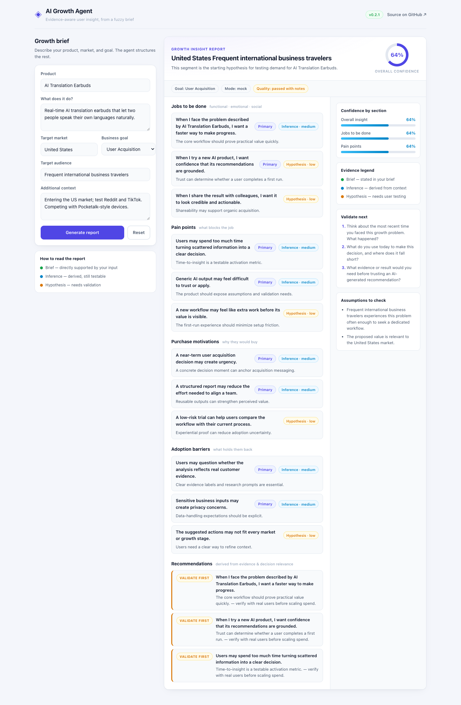

<div align="center">

# AI Growth Agent

**Traceable growth strategy, generated from a fuzzy product brief.**

[](https://github.com/ftw10181-oss/ai-growth-agent/actions/workflows/ci.yml)
[](./backend/tests/)
[](./evals/)
[](./frontend/)
[](./LICENSE)

</div>

AI Growth Agent turns a half-formed product idea and target audience into a structured, decision-ready growth strategy. V0.3 connects **Context**, **User Insight**, **Market Hypothesis**, and **Value Proposition** so the user can see how each recommendation was formed, what evidence it inherits, and what should be validated next.

It is built as a portfolio piece for **AI Product Manager**, **AI Application Engineer**, and **Growth Engineer** roles: the focus is the **product surface, the reasoning contract, and the evaluation loop**, not the infra underneath.

---

## V0.3 — From Insight to Strategy

```text
Growth Brief → Context → User Insight → Market Hypothesis → Value Proposition → Quality Gate
```

- A four-decision executive summary: primary user, growth wedge, primary value, and biggest risk
- Item-level `source_refs` that connect downstream strategy to upstream context and user evidence
- Measurable pass/fail signals for every validation priority
- Six deterministic checks for structure, reference integrity, evidence inheritance, market-claim grounding, decision continuity, and testability
- Transparent automatic reframing of risky inferred claims as hypotheses—without upgrading evidence or hiding the original substance
- A recruiter-facing interface that explains the product decisions, architecture, responsible-AI boundary, and evaluation loop

**Live V0.3 portfolio:** [ai-growth-agent-portfolio.markus12138467907.chatgpt.site](https://ai-growth-agent-portfolio.markus12138467907.chatgpt.site/)

The original standalone `/demo` route remains as the V0.2.1 evidence-aware insight showcase.

---

## Live Demo



A standalone `/demo` route ships with the frontend. No signup. No API key. Mock mode runs out of the box.

**Try it live:** [ai-growth-agent.pages.dev/demo](https://ai-growth-agent.pages.dev/demo)

**Try it locally:**

```bash
# 1. Backend (mock mode — no external services needed)
cd backend
python3 -m venv .venv && .venv/bin/pip install -r requirements.txt
APP_MODE=mock .venv/bin/uvicorn app.main:app --host 127.0.0.1 --port 8000

# 2. Frontend (in another terminal)
cd frontend
npm install
npm run dev
# open http://localhost:5173/demo.html
```

**What you can do in the demo**

- Fill in `Product`, `What does it do`, `Target market`, `Business goal`, `Target audience`, `Additional context`.
- Hit **Generate report** — the form is prefilled with a worked example so you see a full report on first load.
- Inspect each item: the `Primary` / `Hypothesis` tag, `Inference — medium` badge, and the side panel's **Confidence by section**, **Evidence legend**, **Validate next**, and **Assumptions to check** tell you where the report is solid and where it needs a human in the loop.

In production the same `/api/analyze` endpoint is served from the Cloudflare Worker in `frontend/worker/index.ts`; swap `APP_MODE=mock` for `APP_MODE=dify` to route to a real LLM via Dify.

### Deployment (Cloudflare Pages)

> **Live:** [ai-growth-agent.pages.dev](https://ai-growth-agent.pages.dev) — deployed to Cloudflare Pages (Advanced mode), running in mock mode.

The demo deploys to the edge as a Cloudflare Pages project in **Advanced mode** — no separate backend is required in production:

- `npm run build` emits static assets to `dist/client/` and compiles the Worker in `frontend/worker/index.ts` into a single self-contained file.
- `scripts/prepare-sites-build.mjs` copies that Worker to `dist/client/_worker.js`, which Cloudflare Pages runs for every route — serving `/api/analyze`, `/health`, and `/demo` from the edge.
- With no `DIFY_API_KEY` configured, the Worker returns mock reports out of the box; set the key as a Pages secret to route `/api/analyze` to a real LLM via the Dify workflow in `dify/`.
- Local preview of the exact Pages artifact: `cd frontend && npm run preview:pages`; production deploy: `npm run deploy:pages` (requires `wrangler login` and a Cloudflare account).

**Deployment settings** (Cloudflare Pages project `ai-growth-agent`): production branch `main`, root directory `frontend`, build command `npm ci && npm run build`, output directory `dist/client`. To route `/api/analyze` to a real LLM, add `DIFY_API_KEY` as a Pages project secret; until then the demo stays in mock mode.

---

## The Story

A growth team rarely starts a research pass with a clean spec. They start with a one-paragraph brief, a Slack thread, maybe a Reddit thread, and a vague goal like "explore US user acquisition". Asking an LLM to "do growth research" on that input produces fluent paragraphs that look like insight but carry no provenance — every sentence is either a restatement of the brief, an unsupported inference, or, in the worst case, a fabrication.

Three things have to be true before an AI-written report is usable inside a growth team:

1. **Every claim has a basis.** Stated in the brief, derived from context, or marked as a hypothesis that still needs user testing.
2. **Every section has a confidence number** the team can read at a glance, so they know which block to push into a meeting and which block to put behind a research question.
3. **The system is testable.** A change in the prompt, the model, or the parser cannot silently lower the quality of the output — there is a regression suite that fails CI when it does.

AI Growth Agent is the small product that gets those three things right. It wraps an LLM (real or mock) in an agent workflow that emits a typed schema, attaches evidence metadata to each item, and is guarded by an offline evaluation contract that runs on every commit.

---

## Why This Matters

A traditional LLM call is a one-shot text generator.

```
Input → AI → Text
```

AI Growth Agent inserts three layers between the prompt and the output:

```
Input (Growth Brief)
   ↓
AI Agent Reasoning       — job, pain, motivation, barrier, recommendation
   ↓
Evidence Check           — basis, validation status, source attribution
   ↓
Confidence Evaluation    — per-section score, overall confidence
   ↓
Actionable Growth Insight — typed report, recommendations, research questions
```

The bet is simple: AI output is not valuable because it generates text — it is valuable because a human can act on it. Action requires provenance. This product is built around that contract.

---

## Product Case

This case study explains how AI Growth Agent transforms fragmented user feedback into structured and evidence-based growth insights — from the problem it exists for, to a worked scenario and the roadmap ahead.

- **Background** — why overseas growth teams struggle to turn scattered feedback into insight
- **Problem** — manual analysis is slow, hard to validate, and does not scale
- **Solution** — the agent reasoning → evidence → confidence pipeline
- **Example scenario** — a worked, method-only walkthrough (no claimed business results)
- **Product value & future** — what the report returns to the team, and where it goes next

[Read the product case study →](docs/product-case.md)

---

## How It Works

1. **Input.** The user describes a product, a market, an audience, and a goal through the demo form or the `/api/analyze` endpoint.
2. **Agent reasoning.** The LLM is asked to populate a typed `InsightResponse` schema — Jobs, Pain Points, Purchase Motivations, Adoption Barriers, Recommendations, and Assumptions — rather than to write free-form prose.
3. **Evidence layer.** Each emitted item is decorated with `evidence.basis` (`explicit_brief`, `inferred_from_context`, or `hypothesis`), `evidence.confidence` (`high`, `medium`, `low`), and `evidence.validation_status`. Recommendations are tagged with `decision_relevance` (`primary` or `supporting`).
4. **Evaluation system.** An offline suite (`evals/check_outputs.py`) replays a frozen set of 12 cases against the response schema and asserts structural invariants: every `recommendation` must trace to a `pain_point`, every `assumption` must be self-contained, every `hypothesis` must surface as a `research_question`. CI fails the build when invariants break.
5. **Report.** The frontend renders the report in a layout designed for review: confidence scores per section, an evidence legend, a "validate next" panel of research questions, and an "assumptions to check" panel for the human reviewer.

---

## Key Features

- **Structured insight generation.** Every output is a typed `InsightResponse` (Pydantic v2 on the backend, TypeScript on the frontend), so the report cannot drift into unstructured prose.
- **Evidence-based reasoning.** Each item carries a `basis` (`explicit_brief` / `inferred_from_context` / `hypothesis`) and a `validation_status` so the team can tell what is grounded and what is conjecture.
- **Per-section confidence scoring.** Overall confidence and per-section confidence (`Overall insight`, `Jobs to be done`, `Pain points`) are computed from the evidence metadata and surfaced in the UI.
- **Recommendation→pain traceability.** Every recommendation links back to a pain point and a decision relevance, so a reviewer can audit why an action is on the list.
- **LLM output evaluation as a contract.** `evals/check_outputs.py` runs 12 frozen cases offline and asserts schema invariants on every CI run — no live LLM calls, no flake.
- **Quality guardrails in CI.** Three jobs run in parallel: backend pytest + ruff, frontend typecheck + eslint + build, and the offline evaluation gate. A regression in any layer fails the build.
- **Pluggable LLM backend.** `APP_MODE=mock` runs without any external service; `APP_MODE=dify` routes through a Dify workflow, both served from the same `/api/analyze` contract.
- **Edge-deployed demo surface.** The demo is a Cloudflare Worker that serves the React 19 + TypeScript 7 frontend from `/` and `/demo`, keeping the public surface at zero infrastructure cost.

---

## Architecture

```
┌───────────────────────────── Frontend ─────────────────────────────┐
│  React 19 + TypeScript 7 + Vite 8 (MPA)                            │
│  /         — main app                                              │
│  /demo     — standalone Growth Insight Report demo                 │
│  Cloudflare Worker: routes /api/* → backend, serves /demo & assets │
└────────────────────────────────────────────────────────────────────┘
                              │ HTTP
                              ▼
┌─────────────────────────── Backend ─────────────────────────────────┐
│  FastAPI + Pydantic v2                                             │
│  POST /api/analyze  →  analyze() → mock engine | Dify workflow     │
│  Strict response schema: InsightResponse, EvidenceMeta, etc.        │
└────────────────────────────────────────────────────────────────────┘
                              │
                              ▼
┌─────────────────────────── Evals ───────────────────────────────────┐
│  evals/check_outputs.py — offline contract gate (12 cases)          │
│  evals/run_live_baseline.py — optional live quality run             │
│  evals/results/baseline-v0.1/run-summary.json — frozen baseline     │
└────────────────────────────────────────────────────────────────────┘
                              │
                              ▼
┌───────────────────────────── CI ────────────────────────────────────┐
│  backend  → pytest + ruff                                          │
│  frontend → tsc --noEmit + eslint + vite build                      │
│  evals    → python evals/check_outputs.py evals/results/baseline-v0.1│
└────────────────────────────────────────────────────────────────────┘
```

---

## Project Structure

```
ai-growth-agent/
├── backend/                # FastAPI + Pydantic v2 API
│   ├── app/                # Routes, schemas, engines (mock / dify)
│   ├── tests/              # 29 pytest cases
│   └── requirements.txt
├── frontend/               # React 19 + TS 7 + Vite 8 + Cloudflare Worker
│   ├── src/                # App + Demo surfaces, shared Insight types
│   ├── worker/             # Cloudflare Worker entry (routes /api/*)
│   ├── demo.html           # Standalone demo entry (MPA build)
│   └── package.json
├── evals/                  # Offline LLM evaluation contract
│   ├── cases.json          # 12 frozen input/expected cases
│   ├── check_outputs.py    # CI gate (structural invariants)
│   ├── run_live_baseline.py# Optional live quality run
│   └── results/baseline-v0.1/
├── dify/                   # Dify workflow definition for live mode
├── docs/
│   ├── architecture-analysis.md
│   └── images/demo.png     # README demo screenshot
├── .github/workflows/ci.yml
└── README.md
```

---

## Quality & Evaluation

The evaluation suite is the part of this project I am most opinionated about, so it gets its own section.

- **Offline contract** — `evals/check_outputs.py` runs the 12 frozen cases in `evals/cases.json` against the `InsightResponse` schema and asserts structural invariants (recommendations trace to pain points, hypotheses surface as research questions, assumptions are self-contained, etc.). It is the CI gate. It runs without any live LLM, so it is fast and deterministic.
- **Live quality run** — `evals/run_live_baseline.py` is the optional path that exercises the real LLM (mock or Dify) and writes a `run-summary.json` with `case_count`, `success`, `failure`, and per-check counters. The baseline at `evals/results/baseline-v0.1/` is the reference; CI compares against it.
- **What gets asserted** — schema validity, evidence metadata presence, recommendation traceability, assumption self-containment, and per-section confidence coherence. Any violation fails CI on the `evals` job.

---

## Tech Stack

| Layer    | Choice                                                          | Why                                                                    |
| -------- | --------------------------------------------------------------- | ---------------------------------------------------------------------- |
| Backend  | Python 3.11+, FastAPI, Pydantic v2, pytest, ruff                 | Strict typed schema, fast iteration, low ceremony                       |
| Frontend | React 19, TypeScript 7 (tsgo), Vite 8 (MPA), Cloudflare Worker   | Typed surface, fast build, edge deployment of the demo                  |
| Evals    | Python (stdlib), JSON fixtures                                | Deterministic offline gate; no live LLM dependency in CI                |
| CI       | GitHub Actions (3 parallel jobs)                                | Backend tests, frontend build/lint, evaluation gate                     |

---

## Local Development

```bash
# Backend (mock mode)
cd backend && python3 -m venv .venv
.venv/bin/pip install -r requirements.txt
APP_MODE=mock .venv/bin/uvicorn app.main:app --port 8000

# Frontend
cd ../frontend && npm install
npm run dev                # → http://localhost:5173/  (app)
                           # → http://localhost:5173/demo.html  (demo)
npm run typecheck
npm run build              # MPA build → dist/client/{index,demo}.html + _worker.js

# Evaluations
cd ../evals
python3 check_outputs.py evals/results/baseline-v0.1   # offline gate
python3 run_live_baseline.py                           # live run (writes run-summary.json)
```

Copy `backend/.env.example` to `backend/.env` and set `DIFY_API_KEY` (and any other Dify settings) to point the backend at a real LLM via the workflow in `dify/`.

---

## Roadmap

- **Confidence calibration.** The current confidence labels are derived from `evidence.basis`; the next step is to calibrate them against human-rated samples held in `evals/cases.json`.
- **Live evaluation runs in CI.** Today the live run is opt-in; promoting it to a scheduled CI job, and diffing `run-summary.json` against the baseline, is the natural next guardrail.
- **Per-prompt variant testing.** The schema, not the prompt, is the contract today. Adding prompt variants behind the same contract is the obvious A/B surface.

---

## License

[MIT](./LICENSE)
