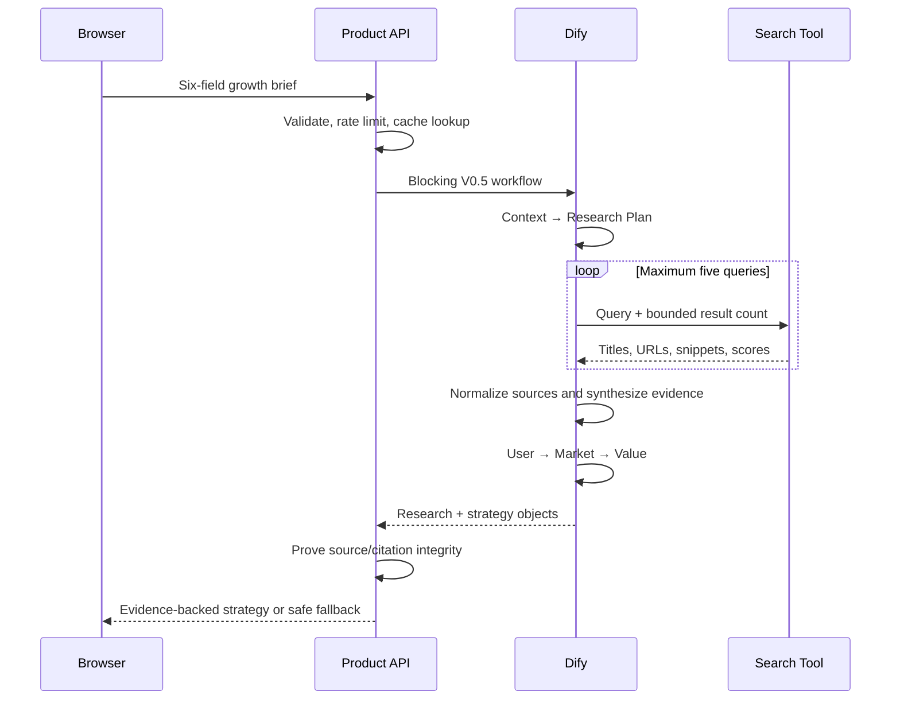

# Architecture — V0.5

## System view

## Architectural decision

The search provider is a replaceable Tool implementation, not part of the
public product contract. V0.5 starts with the official Tavily Dify Tool because
it exposes structured Search results and can later support Extract when a
snippet is insufficient. The product API, evidence models, source IDs, citation
rules, and UI do not expose provider-specific fields.

The first release uses only Search. Crawl, Map, Research, and unrestricted agent
tool selection remain disabled to keep cost and provenance bounded.

## Runtime sequence

## Component responsibilities

### Research Planner

- Receives only the normalized brief
- Returns three to five decision-focused questions
- Defines a query, dimension, evidence need, recency preference, and decision
  impact for every question
- Does not answer the questions

### Search Tool

- Receives planner queries through a bounded iteration
- Returns structured tool output
- Owns provider authentication but no product interpretation
- Cannot write directly to strategy objects

### Source Normalizer

- Runs as deterministic workflow code
- Accepts only URLs returned by the Tool node
- Canonicalizes URLs, removes tracking parameters, deduplicates, and assigns
  stable `SRC-###` identifiers
- Allocates the ten-source budget in rank-by-query order so an early query
  cannot consume all retained evidence
- Preserves query IDs and retrieval time
- Does not invent publishers or publication dates

### Source Evaluator

- Scores relevance to the exact research question
- Classifies source type using transparent categories
- Records date/freshness uncertainty and limitations
- Does not promote a source to verified truth

### Evidence Synthesizer

- Groups compatible source statements into findings
- Keeps supporting and contradicting source IDs separate
- Returns `insufficient` when the evidence threshold is not met
- May cite only IDs from the normalized source manifest
- May use a source for a finding only when their research-question IDs overlap

### Deterministic Evidence Gate

- Runs after model synthesis and before any strategy module
- Removes unresolved sources and sources assigned to a different research question
- Rejects retrieval matches below the documented `0.50` relevance floor
- Recalculates answered-question coverage
- Downgrades unsupported findings and caps `high` confidence when freshness,
  source-type, or snippet-depth requirements are not met
- Returns a machine-readable `evidence_audit`; the model cannot approve its own
  compliance

### Strategy modules

- Retain the V0.3 Context → User → Market → Value continuity contract
- Consume the evidence brief as an additional upstream object
- Do not copy search snippets into recommendations
- Mark uncited market claims as inference or unknown

### Product API quality gate

- Re-validates every typed output
- Confirms every finding source ID resolves
- Confirms every claim citation path and finding ID resolves
- Confirms returned URLs match the normalized source manifest
- Enforces high-confidence evidence thresholds
- Preserves critical conflicts and research gaps
- Returns generic upstream errors without credentials or raw provider payloads

## Public response contract

`POST /api/v5/research-strategy` returns:

- `request_id`
- `mode`: mock or dify
- `research_status`: complete, partial, unavailable, or offline_fixture
- `researched_at`
- `research_plan`
- `evidence_brief`
- `evidence_audit`
- `strategy_summary`
- `context`
- `user_insight`
- `market_hypothesis`
- `value_proposition`
- `claim_citations`
- `quality_review`

V0.3 routes and response models remain unchanged.

## Failure behavior

| Failure | Public behavior |
|---|---|
| One query fails | Continue, return partial research and a visible gap |
| All search queries fail | Return V0.3 strategy with `research_status=unavailable` |
| Search returns too few useful sources | Return `partial`; do not upgrade confidence |
| Unknown URL appears in a citation | Block with `review_required` |
| Critical evidence is contested | Preserve both sides and require review |
| Provider times out | Use a generic error or explicit V0.3 fallback according to configuration |
| Usage quota is reached | Serve a cached result or the clearly labeled V0.3 fallback |

## Security and privacy

- Dify and search credentials remain in server-side secrets
- The frontend never contacts the search provider directly
- Query text contains the submitted product brief but no hidden account data
- No raw authorization header or provider error is logged or returned
- URLs are treated as untrusted external content and rendered with safe link
  attributes
- No automatic page form submission, login, purchase, or personal-data action
  is permitted by the research workflow

## Evaluation architecture

The V0.5 evaluation layer adds:

1. Frozen search fixtures for deterministic contract regression
2. Live-search smoke tests kept separate from CI
3. Citation-resolution and URL-provenance tests
4. Source-diversity and high-confidence threshold tests
5. Human evidence/claim-fit review

This separates repeatable software quality from the naturally changing content
of the web.

## Implementation references

- Dify Tool plugins are the supported extension point for external APIs such as
  web search: https://docs.dify.ai/en/develop-plugin/dev-guides-and-walkthroughs/tool-plugin
- Official Tavily Dify plugin and actions:
  https://github.com/langgenius/dify-official-plugins/tree/main/tools/tavily
