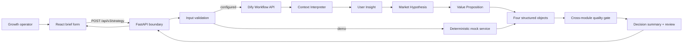
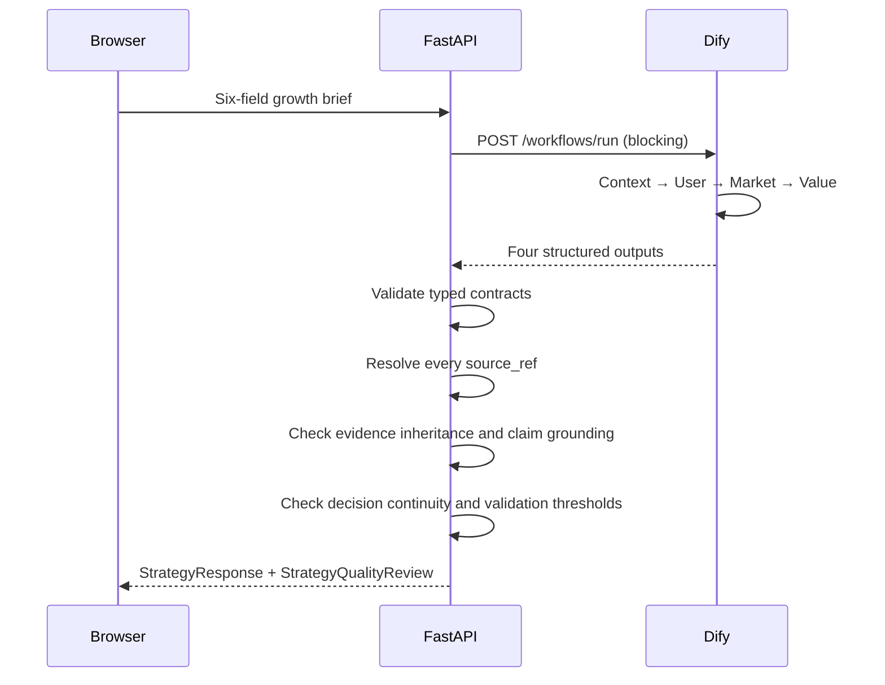

# Architecture — V0.3

## System view

## Why this shape

The frontend talks to a stable product API rather than directly to Dify. Secrets remain server-side, the UI is not coupled to a workflow vendor, and deterministic checks can inspect the complete decision chain after generation.

V0.3 is additive. The V0.2 User Insight routes remain available while `POST /api/v3/strategy` introduces the four-module response. Mock and Dify modes share the same Pydantic contracts and quality logic.

## Components

### Frontend

- React + TypeScript + Vite
- Owns brief state, loading and failure states, and strategy presentation
- Does not own prompts, provider credentials, or evidence rules
- Consumes the V0.3 strategy response and presents the four-decision summary,
  three analysis modules, validation plans, source links, and quality review
- The hosted Sites worker implements the same server-only Dify boundary and
  deterministic strategy checks as the reference FastAPI service

### Backend

- FastAPI with strict Pydantic request and response models
- `POST /api/v3/strategy` for the V0.3 four-module response
- `POST /api/analyze`, `/api/v2/insights`, and `/api/v1/insights` remain compatible
- `GET /health` exposes runtime mode and product version
- Accepts Dify structured outputs as objects or JSON-encoded strings
- Produces the four-decision strategy summary on the server
- Runs deterministic reference, evidence, claim, grounding, continuity, and testability checks

### Dify

- Start collects the existing six-field brief
- Context Interpreter exposes facts, assumptions, and ambiguities
- User Insight generates JTBD, pains, motivations, barriers, and scenarios
- Market Hypothesis generates a growth wedge, risks, and validation priorities
- Value Proposition generates value, positioning, objections, and message tests
- End returns `context`, `user_insight`, `market_hypothesis`, and `value_proposition`

## Runtime sequence

## Contracts

The canonical public models live in `backend/app/models.py`. Matching portable Dify schemas live in `dify/schemas/`.

The V0.3 response contains:

- `strategy_summary`: primary user, growth wedge, primary value, and biggest risk
- `context`: normalized brief
- `user_insight`: evidence-aware user hypotheses
- `market_hypothesis`: opportunity, alternatives, wedge, risks, and validation priorities
- `value_proposition`: values, positioning, reasons to believe, messages, objections, and tests
- `quality_review`: deterministic server result, never model-generated

The adapter accepts structured objects or JSON strings from Dify, then validates both shapes through the same models.

Before the final review, inferred comparative or market language is
conservatively prefixed as an explicit hypothesis. The service reports the
number of automatic revisions and never rewrites claims labeled as direct brief
evidence; a wrongly attributed factual claim therefore remains blocking.

## Cross-module quality gate

The gate separates six concerns:

1. Structural contract
2. Reference integrity
3. Evidence inheritance
4. Market-claim grounding
5. Decision continuity and product support
6. Validation testability

`source_refs` prove traceability, not truth. A valid path can still fail claim grounding if the referenced text does not establish the conclusion. Downstream evidence cannot be stronger than the weakest cited source. A primary value must link to both a user insight and a market hypothesis.

Outcomes remain:

- `passed`: no issue found
- `passed_with_notes`: only non-blocking research or testability notes remain
- `review_required`: reference, evidence, grounding, or continuity failures exist

## Security and reliability

- Provider key is read from the backend environment only
- Configurable request timeout and generic upstream failure messages
- Strict input length, enum, and response validation
- CORS origins controlled by configuration
- No raw provider error, authorization header, or key returned to the client
- No user-data persistence in V0.3

## Evolution path

Future web research should enter as an explicit evidence branch with URL, date,
source quality, and conflict handling rather than silently changing hypothesis
confidence.
