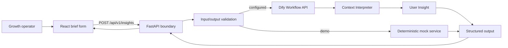
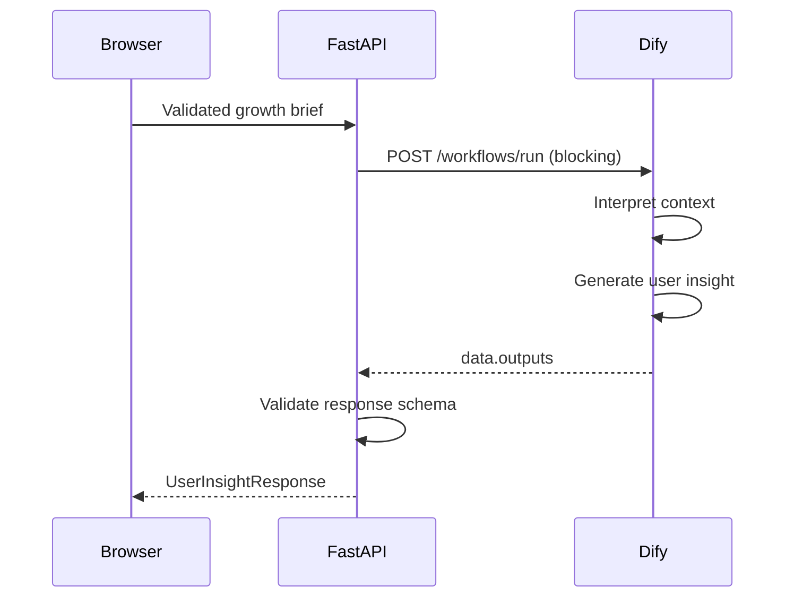

# Architecture — V0.1

## System view

## Why this shape

The frontend talks to a stable product API rather than directly to Dify. This keeps secrets server-side, avoids coupling UI code to a workflow vendor, and gives the product one place to validate, observe, cache, or later replace model orchestration.

Mock mode is a demo adapter, not a second product path. It lets reviewers run the complete experience without credentials; Dify mode uses the same request and response models.

## Components

### Frontend

- React + TypeScript + Vite
- Owns form state, loading/error states, and insight presentation
- Does not own prompts or credentials
- Consumes only the backend contract

### Backend

- FastAPI with Pydantic validation
- `POST /api/v1/insights` orchestration endpoint
- `GET /health` operational endpoint
- Selects mock or Dify service through `APP_MODE`
- Converts Dify `data.outputs` into the public response model

### Dify

- Start node collects the six product variables
- Context Interpreter LLM node outputs `context`
- User Insight LLM node consumes `context` and outputs `user_insight`
- End node exposes both objects

## Runtime sequence

## Contracts

The canonical public contract lives in `backend/app/models.py`. Matching portable schemas live in `dify/schemas/`. Expected Dify output variables are:

- `context`: JSON object matching `context-interpreter.schema.json`
- `user_insight`: JSON object matching `user-insight.schema.json`

Some Dify configurations serialize structured outputs as JSON strings. The adapter accepts either objects or strings, parses them, then validates the final response.

## Security and reliability

- API key read from environment only
- Configurable request timeout
- Generic upstream error messages; credentials and raw headers never reach clients
- Strict input lengths and goal enum
- CORS origins controlled through configuration
- No user data persistence in V0.1

## Evolution path

Each future module should consume the normalized context rather than the raw form. Market research can later add a retrieval/evidence branch, while the public API can add versioned module outputs without rewriting the UI–Dify boundary.

