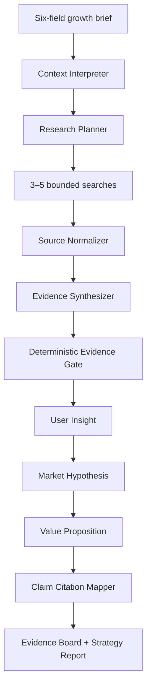

# AI Growth Agent V0.5 — Research Before Recommendation

> An end-to-end AI product case about turning an incomplete growth brief into a current, auditable, decision-ready strategy.
>
> [Open the live product](https://ai-growth-agent.pages.dev/) · [Return to the README](../README.md)

---

## Executive Summary

Growth teams routinely ask AI to recommend audiences, channels, positioning, and experiments from a short brief. The output often looks useful while hiding a fundamental problem: the model has not separated what the team supplied, what current evidence supports, and what it merely inferred.

AI Growth Agent V0.5 changes the order of operations:

```text
Define the decision → Plan the research → Retrieve current evidence
→ Audit the evidence → Build the strategy → Resolve material claims
```

The product delivers an Evidence Board before the recommendation layer. A reviewer can inspect coverage, sources, findings, limitations, conflicts, confidence corrections, and research gaps before acting on the strategy.

This is a portfolio case, not a claim of commercial impact. It demonstrates product judgment, workflow design, responsible-AI boundaries, typed contracts, evaluation, frontend delivery, and production deployment.

---

## 1. The Product Problem

A growth operator usually starts with fragments:

- a product description;
- a target market and audience;
- a goal such as user acquisition or retention;
- channel ideas, competitor names, and internal assumptions;
- no clean research plan and no shared standard for sufficient evidence.

A generic LLM can convert those fragments into persuasive recommendations within seconds. That speed creates three risks.

### False authority

Fluent language makes an inference look like a finding. The reviewer cannot see whether a recommendation came from the brief, a current source, or the model's prior.

### Unbounded research

“Research this market” is not a decision-focused instruction. Without a bounded plan, retrieval gathers whatever is easy to find rather than what the team needs to decide.

### Broken provenance

Even when sources are collected, the connection often disappears downstream. A final positioning statement may include links without showing which finding supports which claim.

The product opportunity was therefore not “generate better growth copy.” It was:

> Make the path from a fuzzy brief to a growth recommendation inspectable, bounded, and testable.

---

## 2. Target User and Job

The primary user is an overseas growth or product operator working on an AI or technology product. They need to move quickly but cannot treat confident model output as market truth.

Their core job is:

> When I need to choose a growth direction with incomplete context, help me identify what is known, research the highest-value unknowns, and produce a strategy I can audit before spending budget.

Secondary users include early-stage founders, international marketers, AI product managers, and growth engineers evaluating agent workflows.

---

## 3. Product Decisions

### Decision 1: plan before search

The workflow first interprets the decision context, then creates three to five questions. Each question has an ID, priority, rationale, and intended decision use.

This bounds cost and latency while making research coverage measurable.

### Decision 2: keep a source manifest

Search results are normalized into a deterministic manifest. Canonical URLs are deduplicated, query provenance is retained, invalid URLs are removed, and the global source count is capped.

The manifest is a product object, not hidden workflow plumbing.

### Decision 3: audit evidence with code

The Evidence Gate is deterministic. It checks question alignment, source availability, diversity, freshness signals, conflict preservation, and confidence rules. When evidence is weak, the gate changes the output instead of asking the LLM to self-police.

### Decision 4: preserve conflicts

A contested finding cannot become a high-confidence recommendation. Supporting and contradicting source IDs remain attached to the same finding so disagreement is visible.

### Decision 5: cite material claims, not paragraphs

The final citation map connects strategy claims to finding IDs. A claim without sufficient resolution remains labeled as inference or unknown.

### Decision 6: keep the human boundary explicit

The workflow can structure evidence and propose priorities. A person still owns commercial judgment, source interpretation, budget allocation, and experiment approval.

---

## 4. V0.5 Workflow



The production path streams Dify workflow events through a Cloudflare Pages Worker. The browser receives progress without receiving the Dify credential, then assembles the typed public report from the successful final event.

---

## 5. The Evidence Board

The Evidence Board is the central V0.5 interface decision. It appears before the strategy modules and answers five review questions.

| Review question | Product signal |
| --- | --- |
| Did the workflow research the intended decision? | Research questions and coverage counts |
| What did it find? | Supported, contested, and insufficient findings |
| Where did each finding come from? | Source IDs, domains, URLs, and query provenance |
| How strong is the evidence? | Confidence, limitations, audit status, and corrections |
| What remains unknown? | Research gaps and unanswered critical questions |

The board intentionally shows limitations beside findings. A source link alone is not treated as proof.

---

## 6. Example Scenario

The live interface is prefilled with a fictional US-entry brief for real-time AI translation earbuds.

```text
Product: AI Translation Earbuds
Market: United States
Audience: Frequent international business travelers
Goal: User Acquisition
Context: Test Reddit and TikTok; competitors have strong marketplace presence
```

The workflow does not assume that business travelers need the product or that a specific channel will work. It might research:

1. Which cross-language moments create the highest perceived cost for the target user?
2. What alternatives do business travelers currently use?
3. Which trust barriers affect adoption of real-time translation hardware?
4. What evidence supports a meeting-first entry scenario?
5. What channel behavior would need validation before paid acquisition?

The report can then distinguish:

- a **supported finding** backed by retained sources;
- a **contested finding** with evidence on both sides;
- an **insufficient finding** that cannot support strong confidence;
- an **inference** that remains useful as a hypothesis;
- an **unknown** that becomes a next research or experiment priority.

No example result is presented as real market or business performance.

---

## 7. Output Contract

V0.5 returns nine typed objects: context, research plan, source manifest, evidence brief, evidence audit, user insight, market hypothesis, value proposition, and claim citations.

Typed outputs create three advantages:

1. The interface cannot silently render a partial free-form answer as a complete report.
2. Offline tests can assert cross-object invariants without a live model call.
3. The same contract can support future model or prompt variants without changing the product surface.

---

## 8. Evaluation Strategy

The repository currently includes:

- 56 backend regression tests;
- 12 frozen evaluation cases covering every supported business goal;
- schema checks for V0.2, V0.3, and V0.5 compatibility;
- deterministic tests for URL normalization, evidence confidence, conflict preservation, citation resolution, quota controls, and public API behavior;
- three parallel GitHub Actions jobs for backend quality, frontend quality, and the offline LLM contract gate.

The eight research-quality checks exposed in the interface cover:

1. research-plan contract;
2. source-manifest integrity;
3. citation resolution;
4. evidence coverage;
5. conflict preservation;
6. source diversity and freshness;
7. claim-language consistency;
8. strategy continuity.

These are product-quality signals. They do not replace human source review or prove commercial impact.

---

## 9. Production and Safety Boundary

The live product is deployed to Cloudflare Pages Advanced Mode.

- The browser calls a same-origin `/api/v5/research-strategy` endpoint.
- The Worker stores the Dify API key server-side.
- Upstream workflow events are proxied as an unbuffered event stream.
- Per-visitor throttling and daily usage limits protect the public API budget.
- The public client validates the final workflow status and required outputs.
- No client-side bundle contains the API key.

Production health is exposed at [`/health`](https://ai-growth-agent.pages.dev/health).

---

## 10. What V0.5 Demonstrates

For an AI Product Manager role:

- problem framing around trust rather than text generation;
- an explicit human–AI decision boundary;
- prioritization of bounded research, provenance, and inspectability;
- a product narrative that links interface choices to workflow constraints.

For an AI Application or Growth Engineer role:

- typed frontend and backend contracts;
- streaming edge delivery;
- reproducible Dify workflow generation;
- deterministic evidence controls outside the model;
- regression tests, CI, public quota protection, and production deployment.

---

## 11. Next Product Bets

1. Calibrate confidence against a human-rated source and finding set.
2. Add scheduled live workflow evaluations with latency, cost, and contract-drift monitoring.
3. Persist strict cross-instance quota accounting.
4. Export Evidence Board snapshots for stakeholder review.
5. Compare model and prompt variants behind the same V0.5 contract.

---

Built by Markus as an independent end-to-end AI product portfolio project.
